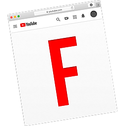
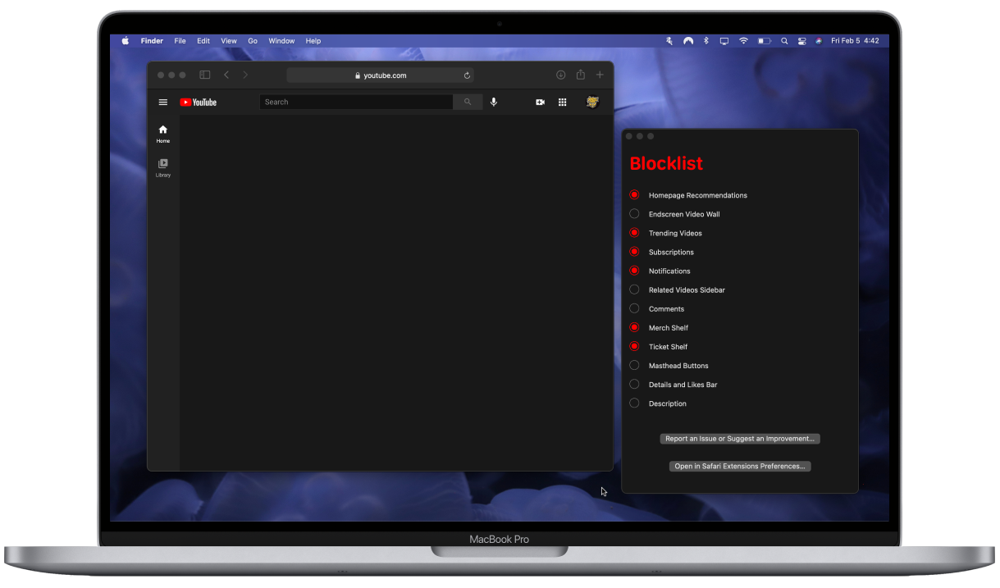

<h1 align="center">
  
    Focus for YouTube 
  
  
</h1>
Focus for YouTube enables users to streamline their video browsing experience. Whether you work on YouTube and are tired of the distractions, or whether you're a teacher who'd rather keep their recommended videos private while screencasting, you'll be able to fix YouTube to your liking within the Focus app. Since Focus disables the loading of many thumbnails, it will also speed up your browsing.
 

**If you prefer a streamlined design for accessibility reasons, please email me at shockerellaapps@gmail.com for 100% off this extension (no questions asked). For example, if you're a person with an intellectual disability or a senior who finds YouTube's UI difficult to navigate, if you have ADHD or a visual impairment, I encourage you to email me to obtain this application for free.**

 

### As seen in...
- [Episode 160 of the Cortex Podcast (hosted by CGP Grey & Myke Hurley) at timestamp 1:33:27](https://www.relay.fm/cortex/160)
- ["How I Set Up my Mac for Productivity" by YouTuber MacVince](https://youtu.be/KxrgLtd_XJ4?t=404)
- ["What's on my MacBook as a minimalist" by YouTuber Fabian](https://youtu.be/gf0LqTG70Rk?t=87)
- ["9 Mac Apps You Shouldn't Miss Out On" by YouTuber MacVince](https://youtu.be/DO3Jk_nQarY?si=vWdhTGjbvRTfYnxJ&t=96)
- ["These Apple Safari extensions help improve my productivity" by John Kanellakos](https://www.pocket-lint.com/these-apple-safari-extensions-improve-productivity/)
- [AAPL Ch.](https://applech2.com/archives/20200829-focus-for-youtube-safari-extension.html)
- [Demo Video by Middle School Teacher, Jason Rosenberg](https://burkeschool.zendesk.com/hc/en-us/articles/31455901969044-Focus-for-YouTube-Safari)
- ["畫面又被擋住了，一招隱藏 YouTube 片尾推薦影片" by YouTuber 傑森 非線性 Jason Nonlinear](https://youtu.be/QBS3UJhlC2k?si=14lpJWnjvaAejiE1&t=150)
